<div align="center">

</div>

<br/>

Backend Java Developer with 4+ years building and operating production systems — REST/GraphQL services, ERP modules, batch pipelines, data reconciliation, and reporting, on Java/Spring Boot over PostgreSQL and MongoDB. Most of that time is spent where the interesting bugs live: the seam between the application, the database, and whatever system it's talking to.

The split below between what's professional experience and what's currently in progress is deliberate — nothing here is inflated.


**Professional**

<table>
  <tr>
    <td align="center" width="96"><br>Java</td>
    <td align="center" width="96"><br>Spring</td>
    <td align="center" width="96"><br>PostgreSQL</td>
    <td align="center" width="96"><br>MongoDB</td>
    <td align="center" width="96"><br>Maven</td>
    <td align="center" width="96"><br>Git</td>
    <td align="center" width="96"><br>GitLab</td>
    <td align="center" width="96"><br>Docker</td>
    <td align="center" width="96"><br>Linux</td>
  </tr>
</table>

`JasperReports`

**Learning**

<table>
  <tr>
    <td align="center" width="96"><br>Kafka</td>
    <td align="center" width="96"><br>Redis</td>
    <td align="center" width="96"><br>AWS</td>
    <td align="center" width="96"><br>React</td>
  </tr>
</table>

`Microservices`

**Exploring** `Data Science` `Machine Learning` `RAG` `AI Systems`


- Backend API development (REST & GraphQL)
- ERP and database-heavy enterprise applications
- Batch processing, data synchronization, and reconciliation
- Third-party integrations
- Reporting systems (JasperReports)
- Production debugging and SQL/query optimization


- [chronos-api](https://github.com/MohammedIsmail18/chronos-api) — Java backend services
- [chronos-ui](https://github.com/MohammedIsmail18/chronos-ui) — Frontend services (TypeScript)
- [DSA-Sheet](https://github.com/MohammedIsmail18/DSA-Sheet) — DSA problem sheets, solutions, patterns, and explanations for coding interview preparation
- [JS-problems](https://github.com/MohammedIsmail18/JS-problems) — Structured collection of JavaScript problems covering fundamentals, concepts, and practical problem-solving


```
Build -> Break -> Debug -> Understand -> Improve
```

I care about what's actually happening below the API layer:

```
Application -> API -> Database -> Integration -> Infrastructure
```

Most of what I've learned professionally came from tracing a bug down through that chain rather than from a tutorial — so that's the loop I default to when learning something new too.


Working through a structured problem-solving track: `Arrays` `Strings` `Linked Lists` `Stacks & Queues` `Trees` `Graphs` `Recursion` `Dynamic Programming`

Also building toward:

- System design & distributed systems
- Database performance
- Cloud technologies (AWS)
- Full-stack development
- Data analysis
- AI/RAG applications


[](mailto:mohammedismail6991@gmail.com)

[](resume.pdf)


Pac-Man eating through my actual contribution graph, regenerated daily by a GitHub Action.

<picture>
    <source media="(prefers-color-scheme: dark)" srcset="https://raw.githubusercontent.com/MohammedIsmail18/MohammedIsmail18/output/pacman-contribution-graph-dark.svg">
    <source media="(prefers-color-scheme: light)" srcset="https://raw.githubusercontent.com/MohammedIsmail18/MohammedIsmail18/output/pacman-contribution-graph.svg">
    
</picture>

<br/>

<div align="center">


<sub>Section labels set in <a href="https://github.com/googlefonts/silkscreen">Silkscreen</a> (SIL OFL 1.1, see <a href="assets/silkscreen-OFL.txt">assets/silkscreen-OFL.txt</a>), embedded directly in the SVGs above.</sub>
</div>
